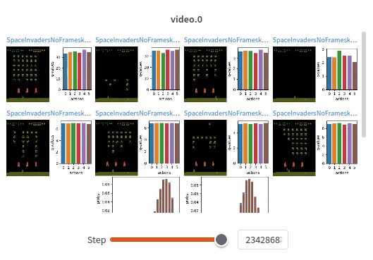

## Game Subsystem

- If memory becomes a problem due to size of `.dat` file, adjust logging frequency 

## Reporting Subsystem

- Embed TensorBoard as an IFrame ([example](https://wandb.ai/costa-huang/sb3-sweep/runs/9ewi83xt/tensorboard)) within the reporting subsystem so that users do not need to go to a different website

- Range slider: the idea is to allow users to select the timeframe window of which they would like the heatmap to be plotted over  
Example:  
{: style="max-width: 25em;"} 
[Screenshot from Plotly](https://plotly.com/python/range-slider/)

- Related to the range slider, but a more conventional slider that allows users to view captured videos/screenshots on a timeline  
Example:  
{: style="max-width: 25em;"} 
[Screenshot from Weights & Biases](https://wandb.ai/cleanrl/cleanrl.benchmark/reports/Atari--VmlldzoxMTExNTI)

- For the data storage file format, consider creating an [EBML](https://matroska-org.github.io/libebml/){:target="_blank"} based format, which combines the space-efficiency of pure binary formats and the flexbility/forwards+backwards compatibility of json. The main drawbacks is that it is not easily humanly readable and may be more complex to read and write. Notable existing formats based on EBML are WEBM and MKV.