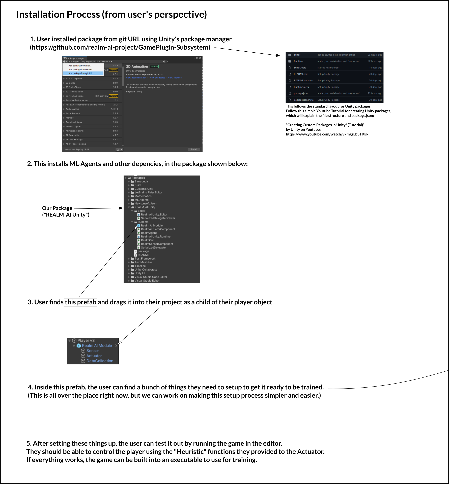

# Installation

The installation process for the users is detailed in the image below, which should also provide an overview of how the package is used.

For step 4, the configuration required of the user is detailed in the Prefab Breakdown page.

The Unity package is designed to be installed simply from its git URL using Unity's built-in package management system. The package is also designed to be able to be installed into an existing game project.

Should there be conflicts with other installed packages, this documentation currently does not provide any details on resolving potential conflicts with other packages.

## Installation for Development

For development, instead of using the "Add package from git URL..." option, clone the repo separately and use the "Add package from disk..." option. In the dialog popup, select the `package.json` file from the cloned repo. This will install directly from the cloned repo. You can then directly modify the package from inside Unity and the changes will be made directly to the files in the cloned repo.
