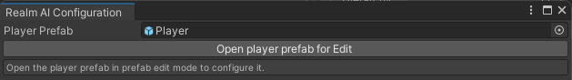

# Project Requirements, Setting up the Player Prefab

To setup RealmAI, it requires there to be a prefab representing the player in the game project.
This prefab should:
- represent the player, i.e. its position represents the player's position in the game world 
- be present in the game Scene or be spawned in as soon as the application is run
- have only one instance in the game environment throughout the game
- ensure that its one instance is never deactivated, disabled, or destroyed throughout the game

If your project does not have a player prefab that satisfy these requirements, please create one, or adjust your code so that the requirements are satisfied. If these requirements cannot be satisfied, your project may not be suitable for RealmAI 😢.

Once you have a player prefab that satisfies the requirements above, let RealmAI know about this prefab by assigning the prefab to the "Player Prefab" field in the Configuration Window in Unity (found under Realm AI/Open Configuration Window), which should look like this:

To continue, open click "Open player prefab for edit" to open the player prefab in prefab edit mode. Once in prefab edit mode, click on "Add Realm AI Module" to add an instance of the "Realm AI Module" prefab (included with the RealmAI package) as a child of the player prefab. This Realm AI Module contains a series of scripts for RealmAI features, which also store all of the configuration needed for these features.

Note: like with the player, there should only be one active instance of the Realm AI Module throughout the game. If you have prefab variants that derive from the player prefab, please disable the Realm AI Module in those prefabs variants.  

