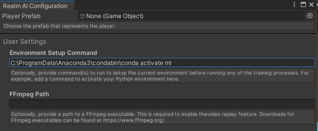

# Setting up the Python Environment

The Unity Package requires the system to have Python 3 installed (this package is tested with version 3.7, but other versions may work), and to have the Python packages `realm-tune`, `realm-gui`, and `realm-report` installed.

You can verify that these are installed by opening a command line and entering the commands `realm-tune`, `realm-gui`, or `realm-report`. They should all run and do something if installed correctly.

## Setting up the Python Environment

It is often recommended to use virtual or isolated environments when using Python. This documentation will not explain why or how to do this, but if you have installed the Python dependencies into a specific environment, Realm AI needs to be able to activate the environment to use these dependencies. To set this up, open the Configuration Window in Unity (found under Realm AI/Open Configuration Window) and near the bottom, enter the command(s) to activate the environment in the "Environment Setup Command" field. An example of the setup for a Conda environment named "ml", on Windows, is shown below:

If you use Python without any environments, just leave this field blank.