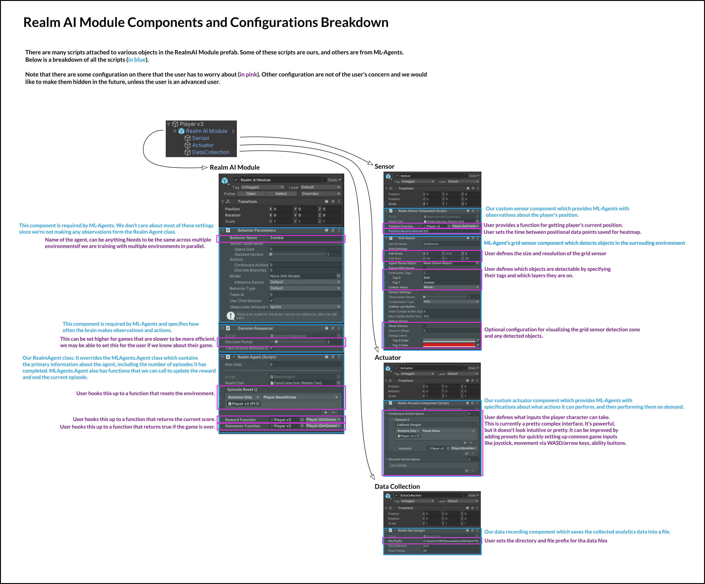

# Realm AI Module Prefab Breakdown

The "Realm AI Module" is a Unity prefab included with our package. The user should drag this into their project as a child of their player object.

The following diagram is a breakdown of the different components on the prefab, as well as the setup that the user has to perform.

