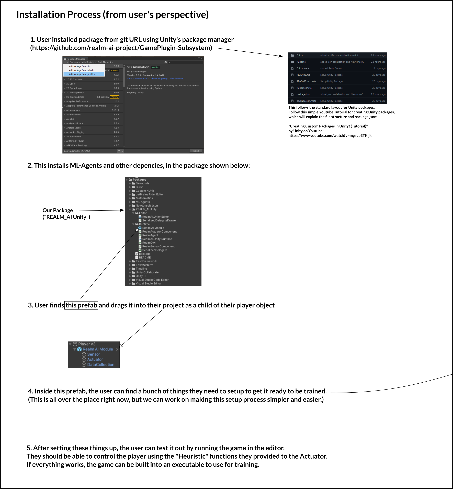

# Game Plugin Subsystem Overview

The game plugin subsystem is a Unity package. For more information on Unity packages, see [the Unity manual](https://docs.unity3d.com/Manual/PackagesList.html) or [this tutorial](https://www.youtube.com/watch?v=mgsLb3TKljk) for how to create one.

## Installation Users and Overview

The installation process for the users is detailed in the image below, which should also provide an overview of how the package is used.

For step 4, the configuration required of the user is detailed in the Prefab Breakdown page.

## Installation for Development

For development, instead of using the "Add package from git URL..." option, clone the repo separately and use the "Add package from disk..." option. In the dialog popup, select the `package.json` file from the cloned repo. This will install directly from the cloned repo. You can then directly modify the package from inside Unity and the changes will be made directly to the files in the cloned repo.
