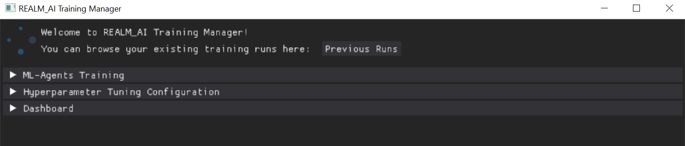
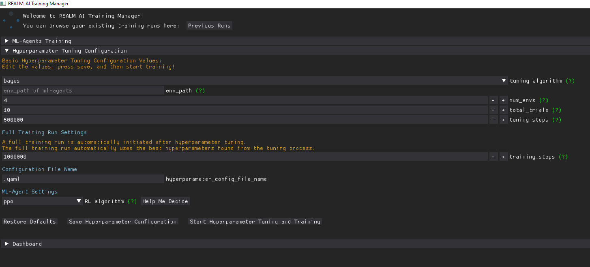
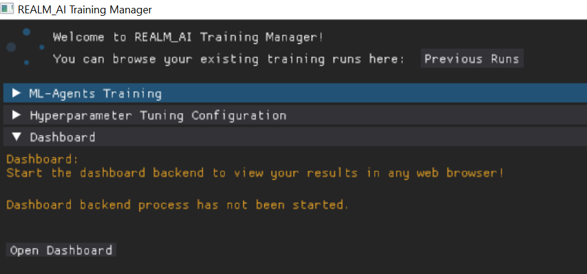

The Python GUI acts as a bridge to connect the Game Plugin Subsystem with the RL Subsystem. It provides an interface for the user to accomplish 3 tasks:

1. Start barebones ML-Agents Training
2. Start Hyperparameter Tuning and use the new tuned values to start ML-Agents Training
3. Open the results dashboard

## Basic ML-Agents Training

The first use case of the Python GUI is to start basic ML-Agents Training. Users will have the option to configure different settings to suit their training requirements. There are 3 buttons at the bottom that can be clicked. They can:

- Restore Default Values
- Save the ML-Agents Configuration file
- Start and Resume ML-Agents training

Please refer to the user guide for a step by step workflow.

## Hyperparameter Tuning and Effective ML-Agents Training

The second use case of the Python GUI is to start hyperparameter tuning and then ML-Agents training. The result of the hyperparameter tuning is an optimized ML-Agents configuration file. Once the hyperparameter tuning is done, ML-Agents training is automatically ran with the optimized configuration file. 

There is a difference between the two options. Simply put, the first option is to just train. The basic ML-Agents training runs the configuration file supplied by the user. The second option is to find the best parameters for training (this process is known as tuning) and then train. The Hyperparameter Tuning and Effective ML-Agents Training will find the optimized values for ML-Agents training to produce the best results. Note that this option will take significantly longer. 

There are 3 buttons at the bottom that can be clicked. They can:

- Restore Default Values
- Save the Hyperparameter Configuration file
- Start and Resume Hyperparameter Tuning and Training

Please refer to the user guide for a step by step workflow.

## Dashboard

The third use case of the Python GUI is to start the dashboard backend to start viewing the results of the training.
