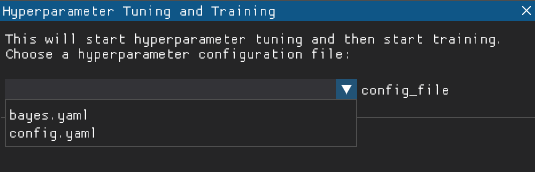

## Generic Information
By hovering over the green question mark for each setting, the recommended typical values are displayed. These values come from [ML-Agents Toolkit](https://github.com/Unity-Technologies/ml-agents/blob/main/docs/Training-Configuration-File.md){:target="_blank"}.

## Ml-Agents Training Workflow
Step 1: Adjust the settings accordingly. If you are unsure about what each setting does, visit [ML-Agents Toolkit](https://github.com/Unity-Technologies/ml-agents/blob/main/docs/Training-Configuration-File.md){:target="_blank"} OR keep the default settings.

Step 2: Change the configuration file name. If the name is not changed, the configuration file will be named `config.yaml`. Press the `Save Ml-Agents Configuration` button and this will create the configuration file. If you would like the settings to be reset, press the `Restore Defaults` button.

Step 3: When you are ready to start Ml-Agents training, press the `Start Training` button. 

Step 4: Select the configuration file you would like to train with.

Step 5: Click the `Proceed` button and your training should start!

## Hyperparameter Tuning and Effective Ml-Agents Training Workflow
Step 1: Adjust the settings accordingly. If you are unsure about what each setting does, keep the default settings.

Step 2: Change the configuration file name. If the name is not changed, the configuration file will be named `config.yaml`. Press the `Save Hyperparameter Configuration` button and this will create the configuration file. If you would like the settings to be reset, press the `Restore Defaults` button.

Step 3: When you are ready to start Hyperparameter Tuning and Ml-Agents Training, press the `Start Hyperparameter Tuning and Training` button. 

Step 4: Select the configuration file you would like to tune and train with.

Step 5: Click the `Proceed` button and your tune & training should start!