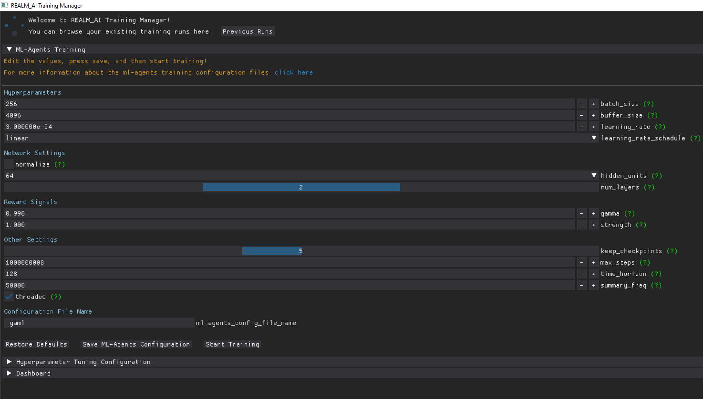

## Generic Information
By hovering over the green question mark for each setting, the recommended typical values are displayed. These values come from [ML-Agents Toolkit](https://github.com/Unity-Technologies/ml-agents/blob/main/docs/Training-Configuration-File.md){:target="_blank"}.

## ML-Agents Training Workflow
Step 1: Adjust the settings accordingly. Visit [ML-Agents Toolkit](https://github.com/Unity-Technologies/ml-agents/blob/main/docs/Training-Configuration-File.md){:target="_blank"} for futher information.

Step 2: Change the configuration file name. If the name is not changed, the configuration file will be named `config.yaml`. Press the `Save ML-Agents Configuration` button and this will create the configuration file. To reset the settings, press the `Restore Defaults` button.

Step 3: To start ML-Agents training, press the `Start Training` button. 

Step 4: Select a configuration file.

Step 5: Click the `Proceed` button and the training will start!

Step 6: There is also an option to continue from a previous run. Select either `Initialize from previous run` OR `Continue previous run`.

Step 7: The `Initialize from previous run` OR `Continue previous run` option require a `Previous Run Results Directory`. Navigate to the file system and paste the path in. Press `Proceed` and the training will resume.

## Hyperparameter Tuning and Effective ML-Agents Training Workflow
Step 1: Adjust the settings accordingly.

Step 2: Change the configuration file name. If the name is not changed, the configuration file will be named `config.yaml`. Press the `Save Hyperparameter Configuration` button and this will create the configuration file. To reset the settings, press the `Restore Defaults` button.

Step 3: To start Hyperparameter Tuning and ML-Agents Training, press the `Start Hyperparameter Tuning and Training` button. 

Step 4: Select a configuration file.

Step 5: Click the `Proceed` button and tune & training will start!

Step 6: There is also an option to continue from a previous run. Select `Continue previous run`.

Step 7: The `Continue previous run` option requires a `Previous Run Results Directory`. Navigate to the file system and paste the path in. Press `Proceed` and the tune & training will resume.

## Dashboard worflow

Step 1:
Press the `Open Dashboard` button to start the local web app.