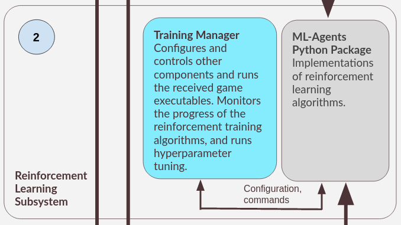

The main goal of the RL subsystem is to allow users to use reinforcement learning(RL) algorithms to train agents to learn to play the game.

While the RL Subsystem can be used completely independently of other subsystems, the recommended use of this subsystem is to be used in conjunction with the rest of the subsystems.

## Overview of the RL Subsystem
{: style="max-width: 25em;"}

The RL Subsystem is made of two components: the [Training Manager](#TrainingManager), and [Unity's ML-Agents Python package](https://pypi.org/project/mlagents/){:target="_blank"}, which is part of the [ML-Agents Toolkit](https://github.com/Unity-Technologies/ml-agents){:target="_blank"}.

## ML-Agents Python Package
Built by [Unity](https://unity.com/){:target="_blank"}, the ML-Agents Python package contains implementations of several commonly used RL algorithms, and allows agents of these algorithms to interact with the game. 

## Training Manager
Since one of the main goals of this project is to ensure that game developers can use the tool without requiring extensive knowledge in RL, the training manager is meant to further simplify the process of using the underlying ML-Agents Python package. This includes the feature of [hyperparameter tuning](hyperparameter_tuning.md), which allows users to use the RL algorithms without the need to manually select the hyperparameters.