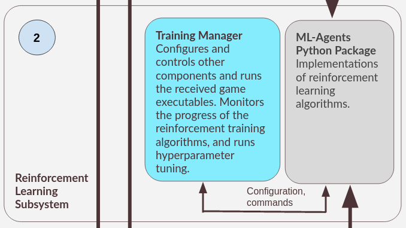

In this section, we outline the purpose of the RL Subsystem, and provide an introduction to the different components of the system.

The main goal of the RL subsystem is to allow users to use reinforcement learning (RL) algorithms to train agents to learn to play the game.

While the RL Subsystem can be used completely independently of other subsystems, the recommended use of this subsystem is to be used in conjunction with the rest of the subsystems.

## Overview of the RL Subsystem
{: style="max-width: 25em;"}

The RL Subsystem is made of two main components: the [Training Manager (realm-tune)](#training-manager-realm-tune) and a [Weights and Biases wrapper (wandb-mlagents-learn)](#weights-and-biases-wrapper-wandb-mlagents-learn) for [Unity's ML-Agents Python package](#ml-agents-python-package).

## Training Manager (realm-tune)
Since one of the main goals of this project is to ensure that game developers/designers can use the tool without requiring extensive knowledge in RL, the training manager is meant to further simplify the process of using the underlying ML-Agents Python package. This includes the main feature of [hyperparameter tuning](hyperparameter_tuning.md), which allows users to use the RL algorithms without the need to manually select the hyperparameters.

## Weights and Biases Wrapper (wandb-mlagents-learn)
Wandb-mlagents-learn is a mini wrapper library for the [ML-Agents Python package](#ml-agents-python-package), and it provides the functionality for users to track ML-Agents experiments using Weights and Biases. Please refer to the [official getting started guide](https://wandb.ai/site/getting-started){:target="_blank"} for more information Weights and Biases, and why it might be a good idea to use it. 

Even though `wandb-mlagents-learn` is a standalone wrapper, it has nicely integrated with The training manager (`realm-tune`), described above.

## ML-Agents Python Package
Built by [Unity](https://unity.com/){:target="_blank"}, the ML-Agents Python package is part of the [ML-Agents Toolkit](https://github.com/Unity-Technologies/ml-agents){:target="_blank"}, and contains implementations of several commonly used RL algorithms. For more information, please refer to the [official documentation of ML-Agents](https://github.com/Unity-Technologies/ml-agents/tree/main/docs){:target="_blank"}.