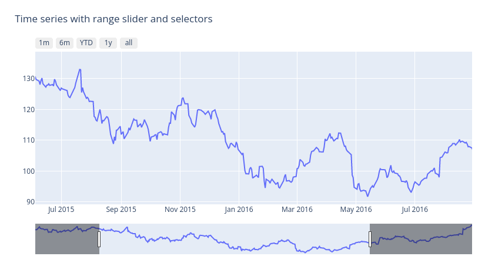
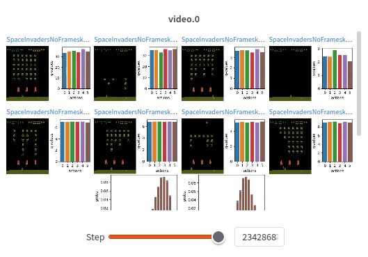

## Game Subsystem

- If memory becomes a problem due to size of `.dat` file, adjust logging frequency 

## Reporting Subsystem

- Embed TensorBoard as an IFrame ([example](https://wandb.ai/costa-huang/sb3-sweep/runs/9ewi83xt/tensorboard)) within the reporting subsystem so that users do not need to go to a different website

- Range slider: the idea is to allow users to select the timeframe window of which they would like the heatmap to be plotted over \
Example: \
{: style="max-width: 25em;"}\
[Screenshot from Plotly](https://plotly.com/python/range-slider/)

- Related to the range slider, but a more conventional slider that allows users to view captured videos/screenshots on a timeline\
Example: \
{: style="max-width: 25em;"}\
[Screenshot from Weights & Biases](https://wandb.ai/cleanrl/cleanrl.benchmark/reports/Atari--VmlldzoxMTExNTI)